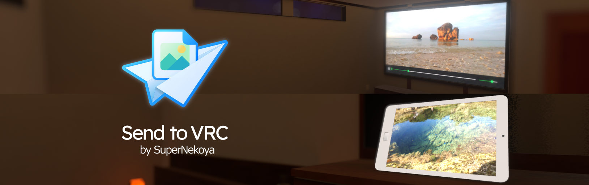

## Introduction

Send to VRCは無料のオープンソースソフトウェアで、VRChatで画像を簡単に共有するためのツールです。
画像は、VRChatで表示できる形式に変換され、クラウドサービスにアップロードされます。
アップロードされた画像のURLをクリップボードにコピーし、VRChat内の動画プレイヤーや画像ビューアに貼り付けて表示できます。

## Screenshots

## Features

- 画像を動画(mp4/h264)に変換してアップロード
- 画像をImageLoadingで読み込み可能な形式に変換してアップロード
- エクスプローラーの右クリックメニューから直接画像を送信
- エクスプローラーの「送る」メニューから直接画像を送信
